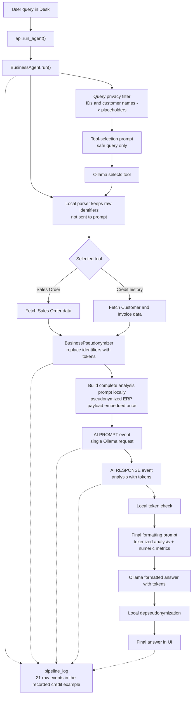

# Frappe AI Agent Demo

Educational demo of an AI agent running on a **local LLM (Ollama)** with **automatic sensitive-data
pseudonymization** powered by spaCy NER. Built to show, step by step, how an agent can analyze
business data from ERPNext while keeping personal data out of the model prompt.

## What it demonstrates

| Feature | How |
|---|---|
| Tool selection | LLM picks one of two tools from a user query |
| Sensitive-data detection | spaCy NER (`en_core_web_sm`) + custom regex (EMAIL, PHONE, SSN, IBAN, ZIPCODE, …) |
| Pseudonymization | Consistent mapping: `"Jane Doe" → PERSON_01`, reversed before the answer is shown |
| Pipeline transparency | Every step (fetch → detect → pseudonymize → LLM → de-pseudonymize) is logged and rendered in the UI |
| Local-only inference | All LLM calls go to `localhost:11434` (Ollama) — data never leaves the host |

## Architecture (actual code layout)

```
ai_agent_demo/
├── hooks.py
├── modules.txt
├── patches.txt
├── patches/
│   └── create_demo_data.py        # creates demo customers / items / sales orders
├── config/
│   └── desktop.py
└── ai_agent_demo/
    ├── api.py                     # whitelisted endpoints: get_agent_status, get_available_tools, run_agent
    ├── core/
    │   ├── agent.py               # BusinessAgent — calls Ollama, parses tool selection
    │   ├── tools.py               # SalesOrderAnalyzer, CustomerCreditAnalyzer (subclasses of BaseTool)
    │   ├── pseudonymizer.py       # BusinessPseudonymizer — tokenizes detected entities
    │   └── ner_detector.py        # SpacyNERDetector — spaCy NER + custom regex
    ├── doctype/
    │   ├── agent_session/         # session metadata
    │   └── agent_log/             # one row per agent run
    └── page/
        └── ai_agent_demo/         # Frappe Page (vanilla JS + injected CSS, no build step)
```

## Available tools

Both tools are registered in [`core/tools.py`](ai_agent_demo/ai_agent_demo/core/tools.py):

- **`analyze_sales_order`** — fetches a Sales Order, pseudonymizes customer/contact data, sends it
  to the LLM for risk analysis, then de-pseudonymizes the response.
- **`check_customer_credit_history`** — aggregates outstanding invoices, payment delays, and
  recent orders to produce a credit risk summary.

## Request flow

```
User query
   │
   ▼
BusinessAgent.run()                           ← core/agent.py
   │  ├─ _create_safe_tool_selection_query
   │  ├─ _create_tool_selection_prompt
   │  ├─ Ollama /api/generate (llama3.2)
   │  └─ _parse_tool_selection (local ID extraction and validation)
   ▼
Tool.execute()                                ← core/tools.py
   │  ├─ fetch ERP data (frappe.get_doc / frappe.db.sql)
   │  ├─ BusinessPseudonymizer
   │  │     └─ SpacyNERDetector.detect_entities    ← core/ner_detector.py
   │  ├─ build one complete prompt containing pseudonymized ERP data
   │  ├─ Ollama /api/generate (single analysis request)
   │  └─ BusinessPseudonymizer.depseudonymize_text
   ▼
BusinessAgent creates final formatting prompt
   │  └─ Ollama /api/generate (tokenized analysis + numeric metrics)
   ▼
pipeline_log returned to the page             ← page/ai_agent_demo/ai_agent_demo.js
```

Pseudonymized ERP data is embedded locally in the complete analysis prompt. It is
not sent to the model or logged as a separate `ai_input_data` event before that prompt.

## Privacy-safe prompt flow

The privacy boundary is explicit: the model never needs the raw user query or
restored business identifiers. Local application code keeps the real Sales Order
ID or Customer name for tool execution, while every Ollama prompt receives either
a sanitized query, pseudonymized ERP data, or tokenized analysis.



Detailed privacy and prompt flow map:
[`docs/privacy_prompt_flow.md`](docs/privacy_prompt_flow.md)

## Requirements

- Frappe v14+ (and ERPNext for Sales Order / Customer / Sales Invoice doctypes)
- Ollama running locally with a chat model (`llama3.2` by default)
- Python `spacy>=3.7` + `en_core_web_sm` model

## Installation

```bash
# 1. Ollama
curl -fsSL https://ollama.ai/install.sh | sh
ollama pull llama3.2
ollama serve

# 2. spaCy model (or run ./install_spacy.sh)
pip install spacy>=3.7
python -m spacy download en_core_web_sm

# 3. App
bench get-app https://github.com/siasty/Ai-agent-demo-
bench --site your-site.local install-app ai_agent_demo
bench --site your-site.local migrate
bench restart
```

The `create_demo_data` patch runs automatically on migrate and seeds 6 customers, 10 electronic
parts, and 6 sales orders (TechParts Inc. scenario).

Open in the Desk: **Menu → AI Agent Demo**, or go directly to `/app/ai-agent-demo`.

## Example queries

- `Analyze sales order SAL-ORD-2026-00006 for risks`
- `Check credit history for MicroDevices Partners`

## Recorded event-log demo

The generated recording for `Check credit history for MicroDevices Partners` is stored in
[`demo_recordings/credit_history_event_viewer.html`](demo_recordings/credit_history_event_viewer.html).
It uses the full `run_agent` result. The source log has 21 `pipeline_log` events; the viewer shows
9 presentation steps by hiding status-only markers and presenting each meaningful operation as
payload plus response where applicable. Click any event in the timeline to inspect the payload for
that step.

Source data for the same run is available as
[`demo_recordings/credit_history_tool_demo.json`](demo_recordings/credit_history_tool_demo.json).

## License

MIT
