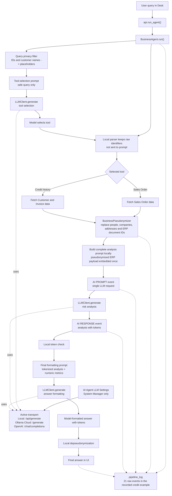

# Frappe AI Agent Demo

Educational demo of an AI agent using either **local Ollama**, **Ollama Cloud**,
or an **OpenAI-compatible public API**, with **automatic sensitive-data pseudonymization**
powered by spaCy NER. Built to show, step by step, how an agent can analyze
business data from ERPNext while keeping personal data out of the model prompt.

## What it demonstrates

| Feature | How |
|---|---|
| Tool selection | LLM picks one of two tools from a user query |
| Sensitive-data detection | spaCy NER (`en_core_web_sm`) + custom regex (EMAIL, PHONE, SSN, IBAN, ZIPCODE, …) |
| Pseudonymization | Consistent mapping: `"Jane Doe" → PERSON_01`, `SAL-ORD-* → SALES_ORDER_01`, reversed before the answer is shown |
| Pipeline transparency | Every step (fetch → detect → pseudonymize → LLM → de-pseudonymize) is logged and rendered in the UI |
| Configurable inference | A System Manager switches the whole pipeline between local Ollama, native Ollama Cloud, and an OpenAI-compatible public API |
| Secret handling | Public API keys use Frappe's encrypted `Password` storage and are never returned to the browser |

## Architecture (actual code layout)

```
ai_agent_demo/
├── hooks.py
├── modules.txt
├── patches.txt
├── patches/
│   └── create_demo_data.py        # creates demo customers / items / sales orders
├── config/
│   └── desktop.py
└── ai_agent_demo/
    ├── api.py                     # agent and System Manager-only LLM settings endpoints
    ├── core/
    │   ├── agent.py               # BusinessAgent — selects tools and formats answers
    │   ├── llm_client.py          # shared local Ollama / Ollama Cloud / OpenAI client
    │   ├── tools.py               # SalesOrderAnalyzer, CustomerCreditAnalyzer (subclasses of BaseTool)
    │   ├── pseudonymizer.py       # BusinessPseudonymizer — tokenizes detected entities
    │   └── ner_detector.py        # SpacyNERDetector — spaCy NER + custom regex
    ├── doctype/
    │   ├── ai_agent_llm_settings/ # global Single DocType; System Manager only
    │   ├── agent_session/         # session metadata
    │   └── agent_log/             # one row per agent run
    └── page/
        └── ai_agent_demo/         # Frappe Page (vanilla JS + injected CSS, no build step)
```

## Available tools

Both tools are registered in [`core/tools.py`](ai_agent_demo/ai_agent_demo/core/tools.py):

- **`analyze_sales_order`** — fetches a Sales Order, pseudonymizes customer/contact data, sends it
  to the LLM for risk analysis, then de-pseudonymizes the response.
- **`check_customer_credit_history`** — aggregates outstanding invoices, payment delays, and
  recent orders to produce a credit risk summary.

## Request flow

```
User query
   │
   ▼
BusinessAgent.run()                           ← core/agent.py
   │  ├─ _create_safe_tool_selection_query
   │  ├─ _create_tool_selection_prompt
   │  ├─ LLMClient.generate (configured provider)
   │  └─ _parse_tool_selection (local ID extraction and validation)
   ▼
Tool.execute()                                ← core/tools.py
   │  ├─ fetch ERP data (frappe.get_doc / frappe.db.sql)
   │  ├─ BusinessPseudonymizer
   │  │     └─ SpacyNERDetector.detect_entities    ← core/ner_detector.py
   │  ├─ build one complete prompt containing pseudonymized ERP data
   │  ├─ LLMClient.generate (single analysis request)
   │  └─ BusinessPseudonymizer.depseudonymize_text
   ▼
BusinessAgent creates final formatting prompt
   │  └─ LLMClient.generate (tokenized analysis + numeric metrics)
   ▼
pipeline_log returned to the page             ← page/ai_agent_demo/ai_agent_demo.js
```

Pseudonymized ERP data is embedded locally in the complete analysis prompt. It is
not sent to the model or logged as a separate `ai_input_data` event before that prompt.

## Privacy-safe prompt flow

The privacy boundary is explicit: the model never needs the raw user query or
restored business identifiers. Local application code keeps the real Sales Order
ID or Customer name for tool execution, while every LLM prompt receives either
a sanitized query, pseudonymized ERP data, or tokenized analysis.



Detailed privacy and prompt flow map:
[`docs/privacy_prompt_flow.md`](docs/privacy_prompt_flow.md)

## Requirements

- Frappe/ERPNext v15
- [Frappe Workspace Embedder](https://github.com/siasty/workspace_embedder)
- Ollama with a local model (`llama3.2` by default), Ollama Cloud, or an
  OpenAI-compatible HTTPS Chat Completions endpoint and API key
- Python dependencies declared in `pyproject.toml`; the spaCy
  `en_core_web_sm` model is installed automatically with the app

## Installation

### Automated Linux demo

On a clean Ubuntu/Debian machine with `systemd`, run the installer as a regular
user with `sudo` access:

```bash
chmod +x install_demo_environment.sh
./install_demo_environment.sh
```

It installs MariaDB, Redis, Node.js, Yarn, Bench, Frappe v15, ERPNext,
Workspace Embedder, AI Agent Demo, spaCy, `en_core_web_sm`, and optionally
Ollama with `llama3.2`. It creates `demo.localhost`, runs the tests, and starts
the development server at `http://demo.localhost:8000`.

The defaults are intended only for a local disposable demo:

```bash
# Install without Ollama, skip tests, and do not start bench automatically
INSTALL_OLLAMA=0 RUN_TESTS=0 START_DEMO=0 ./install_demo_environment.sh

# Override the site and Administrator password
SITE_NAME=agent.localhost ADMIN_PASSWORD='change-me' ./install_demo_environment.sh
```

### Manual installation

```bash
# 1. Optional local inference
curl -fsSL https://ollama.com/install.sh | sh
ollama pull llama3.2
ollama serve

# 2. ERPNext, Workspace Embedder, then AI Agent Demo
cd /path/to/frappe-bench
bench get-app --branch version-15 erpnext https://github.com/frappe/erpnext
bench get-app --branch develop workspace_embedder https://github.com/siasty/workspace_embedder.git
bench get-app https://github.com/siasty/Ai-agent-demo-
bench setup requirements --python ai_agent_demo
bench --site your-site.local install-app erpnext
bench --site your-site.local install-app workspace_embedder
bench --site your-site.local install-app ai_agent_demo
bench --site your-site.local migrate
bench restart
```

`bench setup requirements --python ai_agent_demo` installs `spacy` and the
pinned `en_core_web_sm` wheel into the bench Python environment from
`pyproject.toml`. `install_spacy.sh` is retained only as a manual repair command
for an existing bench.

The `create_demo_data` patch runs automatically on migrate and seeds 6 customers, 10 electronic
parts, and 6 sales orders (TechParts Inc. scenario).

Open in the Desk: **Menu → AI Agent Demo**, or go directly to `/app/ai-agent-demo`.

## LLM provider configuration

Only users with the **System Manager** role can configure the provider:

1. Open **AI Agent Demo** in Desk.
2. Click **LLM Settings** in the page toolbar.
3. Select **Local Ollama** or **Public API**.
4. For **Public API**, choose **Ollama Native** or **OpenAI Compatible**, then
   enter the provider URL, model, API key, and request timeout.
5. Click **Test connection**. This sends the small prompt
   `Reply with exactly: OK` and may incur a provider charge.
6. Click **Save**. The selection applies to tool selection, tool analysis, and
   final answer formatting.

For Ollama Cloud, select **Ollama Native** and use
`https://ollama.com/api`; the app sends `POST /generate` with a Bearer API key.
For OpenAI, select **OpenAI Compatible** and use
`https://api.openai.com/v1`; the app sends `POST /chat/completions`.
Other providers work when they implement that compatible request and response
format. Public URLs must use HTTPS. See the
[Ollama API introduction](https://docs.ollama.com/api/introduction) and
[authentication guide](https://docs.ollama.com/api/authentication).

The key is stored in Frappe's encrypted password store. The settings endpoint
returns only `api_key_set: true|false`; it never sends the key to JavaScript.
Leaving the key field blank keeps the saved value. Use **Remove saved API key**
to delete it explicitly. The page status verifies Ollama automatically, while a
public API is shown as configured until **Test connection** is used, avoiding an
automatic billable model call on every page load.

For official Ollama Cloud, the status bar provides an **Ollama Usage** link to
the provider dashboard. Ollama measures plan usage mainly by GPU time, model
weight, request duration, and cached context rather than by a fixed token quota.
Session limits reset every 5 hours and weekly limits every 7 days. Because the
Ollama API does not expose the remaining plan allowance, the application does
not estimate it from token counts. See the official
[Ollama usage and plan description](https://ollama.com/pricing).

The same privacy boundary applies to all providers. Before any analysis prompt,
customer/contact fields and ERP document references such as Sales Order and
Sales Invoice IDs are replaced with local tokens. Original identifiers are
restored only after the final model response.

## Example queries

- `Analyze sales order SAL-ORD-2026-00006 for risks`
- `Check credit history for MicroDevices Partners`

## Recorded event-log demo

The generated recording for `Check credit history for MicroDevices Partners` is stored in
[`demo_recordings/credit_history_event_viewer.html`](demo_recordings/credit_history_event_viewer.html).
It uses the full `run_agent` result. The source log has 21 `pipeline_log` events; the viewer shows
9 presentation steps by hiding status-only markers and presenting each meaningful operation as
payload plus response where applicable. Click any event in the timeline to inspect the payload for
that step.

Source data for the same run is available as
[`demo_recordings/credit_history_tool_demo.json`](demo_recordings/credit_history_tool_demo.json).

## GitHub Pages deployment

The workflow
[`deploy-credit-history-viewer.yml`](.github/workflows/deploy-credit-history-viewer.yml)
publishes the standalone event viewer as the root GitHub Pages site. It includes
the source JSON and does not require Frappe, Ollama, a build step, or external
frontend dependencies.

For the first deployment, select **Settings → Pages → Build and deployment →
Source: GitHub Actions** in the GitHub repository. Then push the viewer changes
to `main` or run **Deploy credit history event viewer** manually from the Actions
tab. The expected project URL is:
[`https://siasty.github.io/Ai-agent-demo-/`](https://siasty.github.io/Ai-agent-demo-/).

## License

MIT
