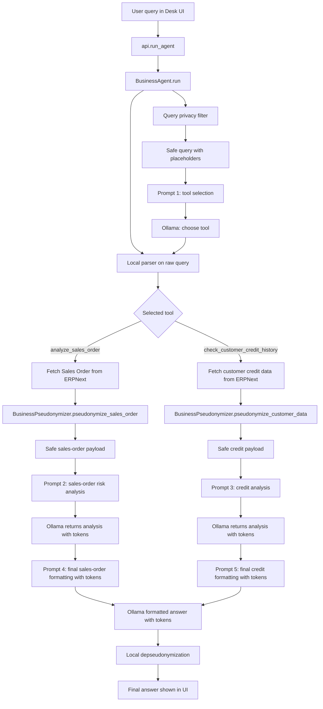

# AI Agent Demo - privacy and prompt flow map

This file maps where sensitive data is filtered, which prompts exist, and what
each prompt receives. The key rule after the privacy fix is:

> Raw user query and restored identifiers are not sent to Ollama prompts.

## Graphical Flow

## Prompt Map

| Prompt | Code location | Data passed to model | Privacy status |
|---|---|---|---|
| Tool selection | `core/agent.py::_create_tool_selection_prompt` | `safe_user_query` from `_create_safe_tool_selection_query` | Raw query is not sent. Sales Order IDs, resolved customer names, and NER-detected entities are replaced with placeholders. |
| Sales-order analysis | `core/tools.py::SalesOrderAnalyzer._create_analysis_prompt` | `pseudonymized_data` from `BusinessPseudonymizer.pseudonymize_sales_order` | Sensitive ERP fields are tokenized before the prompt is created. |
| Customer credit analysis | `core/tools.py::CustomerCreditAnalyzer._create_credit_analysis_prompt` | `pseudonymized_data` from `BusinessPseudonymizer.pseudonymize_customer_data` | Sensitive customer/contact fields are tokenized before the prompt is created. |
| Final sales-order answer | `core/agent.py::_create_sales_order_answer_prompt` | `analysis_for_llm` plus numeric-only `metrics` | The prompt receives tokenized analysis, not restored identifiers. |
| Final credit answer | `core/agent.py::_create_credit_answer_prompt` | `analysis_for_llm` plus numeric-only `metrics` | The prompt receives tokenized analysis, not restored identifiers. |
| Fallback final answer | `core/agent.py::_create_final_answer_prompt` | Generic tool result | Used only for unknown tools; current registered tools use the specific final prompts above. |

## Where The Privacy Filter Runs

`BusinessAgent.run()` calls `_create_safe_tool_selection_query()` before creating
the tool-selection prompt. That function:

1. Bounds the query to `MAX_TOOL_SELECTION_QUERY_CHARS`.
2. Replaces ERP Sales Order IDs with `SALES_ORDER_ID`.
3. Resolves customer names locally for credit-history questions and replaces them
   with `CUSTOMER_NAME`.
4. Runs `BusinessPseudonymizer.pseudonymize_text_auto()` for remaining names,
   emails, phones, organizations, locations, tax IDs, and similar entities.

The raw query is still used locally by `_parse_tool_selection()` so the app can
extract the real `sales_order_id` or `customer_name` without showing those values
to the tool-selection prompt.

## Where Identifiers Are Restored

Tool analysis still restores identifiers for the UI pipeline log, but the final
formatting prompt uses `analysis_for_llm`, which is the tokenized model response.
After the final model response is produced, `BusinessAgent._restore_identifiers()`
replaces tokens locally using `pseudonym_reverse_mapping`.

Internal fields used for this handoff are removed from `steps` by
`BusinessAgent._public_tool_result()` before the API response can persist or show
the technical tool output.
